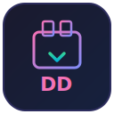

<p align="center">
  
</p>

<h1 align="center">DD-imager</h1>

<p align="center">A lightweight GTK4 wizard for safely writing ISO/IMG files to USB drives.</p>

## Features

- Step-by-step wizard: select image, verify checksum, pick drive, write
- Optional SHA-256 checksum verification before writing
- Only shows removable USB drives — internal NVMe/SATA drives are never exposed
- Real-time progress bar during write
- Double confirmation before any destructive operation
- GUI runs unprivileged — only `dd` is elevated via polkit
- Cross-distro: works on Arch, Debian, Ubuntu, Fedora, Kali, and more

## Safety

DD-imager is built with safety as the primary concern:

1. **Internal drives are filtered out** — device detection reads `/sys/block/*/removable` and excludes anything that isn't a removable USB device
2. **No default drive selection** — you must explicitly choose a target
3. **Double confirmation** — a dialog warns you before any write
4. **Device re-verification at write time** — the target is checked again immediately before writing to guard against device changes
5. **Size check** — warns if the image is larger than the target drive
6. **Auto-unmount** — target partitions are unmounted before writing
7. **Minimal privilege** — only `dd` runs as root via polkit; the GUI stays unprivileged

## Install

```bash
git clone https://github.com/invisi101/DD-imager.git
cd DD-imager
chmod +x install.sh
./install.sh
```

This installs dependencies, copies the app to `/usr/local/bin/dd-imager`, sets up the polkit policy, and adds a `.desktop` file so it appears in your app launcher.

Supports Arch Linux, Debian/Ubuntu, and Fedora.

## Uninstall

```bash
./uninstall.sh
```

## Usage

Launch from your app launcher, or from the terminal:

```bash
dd-imager
```

The wizard walks you through four steps:

1. **Select ISO** — browse for an `.iso` or `.img` file (defaults to `~/Downloads`)
2. **Verify Checksum** — optionally paste a SHA-256 hash to verify the image (or skip)
3. **Select Drive** — pick from detected removable USB drives
4. **Confirm & Write** — review the summary, confirm, and write with live progress

## Dependencies

- Python 3
- GTK 4
- libadwaita
- python-gobject
- udisks2

## License

MIT
